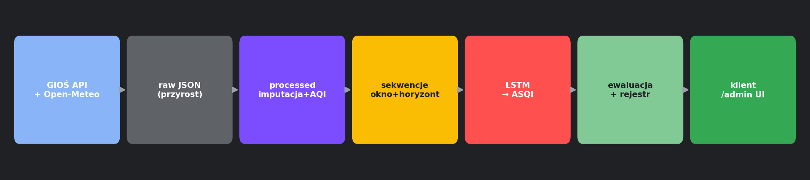

# 1. Wprowadzenie i architektura

## 1.1. Cel produktu

**AirSense Quality AI** prognozuje **jakość powietrza**, nie pogodę. Produktowy wskaźnik prognozy to **ASQI** (*AirSenseQualityIndex*) — skala 0–100, gdzie wyższa wartość oznacza gorsze powietrze (jak EAQI/GIOŚ).

Pogoda (temperatura, wilgotność, wiatr) jest **cechą wejściową modelu LSTM**, ale **nie wchodzi do wzoru** na indeks. Szczegóły metodyki: [METODYKA_AirSenseQuality.md](../METODYKA_AirSenseQuality.md).

## 1.2. Nazewnictwo wskaźników (krytyczne)

| Nazwa w UI | Kolumna / źródło | Znaczenie |
|---|---|---|
| **GIOŚ AQI** | `GiosAQI` w `processed` | Pomiar ze stacji GIOŚ (wzór kompozytowy) |
| **ASQI** | `AirSenseQualityIndex` | **Tylko prognoza LSTM** — nie zapisujemy w processed |
| **Open-Meteo** | `OpenMeteoCompositeIndex` | Ten sam wzór co GiosAQI, ze stężeń prognozy OM |
| **EuropeanIndex** | `EuropeanIndex` | Wariant EAQI: `max(sub-indeksów)` |

## 1.3. Dwa widoki aplikacji

| Ścieżka | Moduł | Rola |
|---|---|---|
| `/` | `views/client_page.py` | Widok publiczny: hero ASQI, zakładki, picker dni |
| `/admin` | `views/admin_router.py` | Panel: dane, trening, modele, ewaluacja, ustawienia |

Wejście: `app.py` → `app_pages.build_pages()` → `st.navigation(..., position="hidden")`.

## 1.4. Mapa modułów Python

```
app.py, app_pages.py          # routing Streamlit
env_config.py                 # loader .env (bez python-dotenv)
config.py                     # stałe globalne + walidacja sliderów

data_fetch.py                 # API GIOŚ/OM, czyszczenie, prognoza
data_store.py                 # JSON per stacja (raw + processed)
feature_engineering.py        # cechy kalendarzowe, finalizacja
air_quality.py                # sub-indeksy, GiosAQI, klasy EAQI

ui_common.py                  # CSS, cache, wykresy, train_lstm, lstm_forecast
ui_icons.py                   # Material Icons
views/client_page.py          # widok klienta
views/admin_router.py         # panel admin

model_registry.py             # pliki .keras / .npy, active/best/LLM
model_eval.py                 # metryki, wykresy ewaluacji
baselines.py                  # persistence, MA, seasonal
training_timing.py            # szacunek czasu treningu
llm_eval.py                   # OpenAI: ocena, rekomendacje
stations_settings.py          # katalog stacji, OpenAI key
gios_audit.py                 # audyt kompletności GIOŚ
normalization_stats.py        # diagnostyka raw vs processed
scripts/refetch_data.py       # narzędzie CLI: przebudowa danych
```

Moduły **niezależne od Streamlita** (testowalne headless): `air_quality`, `data_fetch`, `data_store`, `feature_engineering`, `model_registry`, `training_timing`, `baselines`, `llm_eval`.

## 1.5. Pipeline wysokiego poziomu



1. **Pobranie** — GIOŚ (zanieczyszczenia) + Open-Meteo (pogoda + prognoza).
2. **Magazyn `raw`** — tylko realne odczyty, przyrostowo.
3. **`processed`** — pełne przeliczenie: imputacja, outliery, cechy, `GiosAQI`.
4. **Sekwencje** — okno `time_steps` + horyzont `forecast_horizon`.
5. **LSTM** — uczy się przewidywać trajektorię ASQI (target = `GiosAQI` w treningu).
6. **Rejestr** — `.keras` + meta `.npy`, wybór aktywnego modelu.
7. **UI** — klient pokazuje ASQI LSTM; admin zarządza całym cyklem.

## 1.6. Rozdzielczość czasowa

Cały system pracuje na danych **godzinowych**. Decyzja projektowa: LSTM potrzebuje setek punktów; agregacja dobowa (~30 wierszy) uniemożliwiłaby sensowny trening.

## 1.7. Stacje pomiarowe

- Katalog domyślny w `stations_settings.py` (m.in. Zabrze, Warszawa, Kraków, Gdańsk, Wrocław).
- Admin może **dodać stację z listy GIOŚ**, włączyć/wyłączyć, usunąć.
- Każda stacja: `id` GIOŚ, `lat`, `lon`, etykieta miasta.
- Dane per stacja: `data_store/station_<id>.json`.

## 1.8. Technologie

| Warstwa | Biblioteka |
|---|---|
| UI | Streamlit 1.52 |
| Wykresy | Plotly |
| Dane | pandas, numpy |
| ML | TensorFlow 2.20 / Keras 3 |
| Metryki | scikit-learn |
| LLM (opcja) | openai |
| HTTP | requests |
