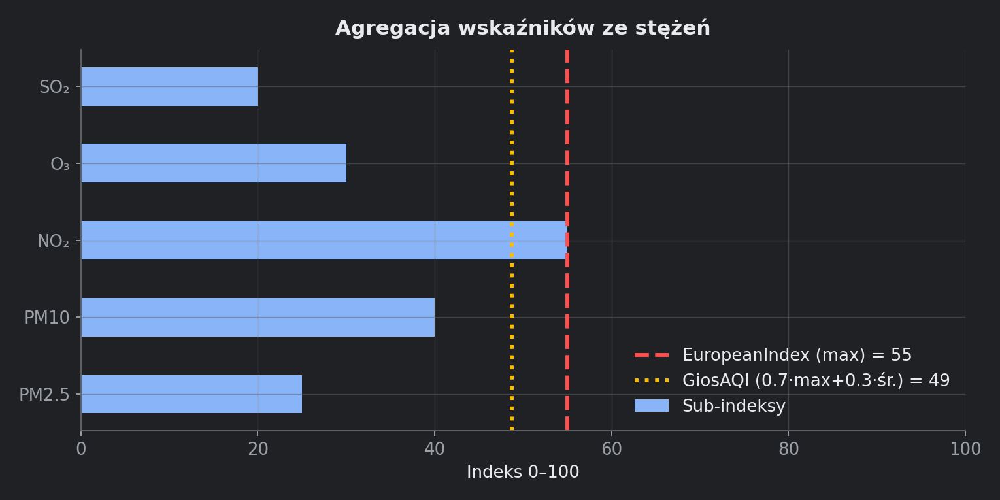

# 4. Wskaźniki i metodyka

Moduł: `air_quality.py`. Uzasadnienie biznesowe: [METODYKA_AirSenseQuality.md](../METODYKA_AirSenseQuality.md).

## 4.1. Sub-indeks per zanieczyszczenie

Dla każdego z 5 zanieczyszczeń EAQI interpolacja liniowa stężenia [µg/m³] w pasmach:

| Kod | Pasma [µg/m³] |
|---|---|
| PM25 | 0, 10, 20, 25, 50, 75, 800 |
| PM10 | 0, 20, 40, 50, 100, 150, 1200 |
| NO2 | 0, 40, 90, 120, 230, 340, 1000 |
| O3 | 0, 50, 100, 130, 240, 380, 800 |
| SO2 | 0, 100, 200, 350, 500, 750, 1250 |

Kotwice indeksu: `[0, 16.7, 33.3, 50, 66.7, 83.3, 100]` (`_INDEX_ANCHORS`).

Funkcje: `pollutant_subindex()`, `compute_subindices()`.

CO i benzen (jeśli w danych) **nie** wchodzą do sub-indeksów — mogą być cechami LSTM.

## 4.2. Dwa wskaźniki złożone



### EuropeanIndex (EAQI-style)

```
EuropeanIndex = max(sub_indeksy)
```

Zasada „najgorszy parametr rządzi”.

### GiosAQI (kompozyt autorski)

```
GiosAQI = 0.7 × max(sub) + 0.3 × mean(sub)
```

Wagi: `W_MAX = 0.7`, `W_MEAN = 0.3` w `air_quality.py`.

Zawsze: `GiosAQI ≥ EuropeanIndex`. Różnica pokazuje „skumulowanie” wielu podwyższonych parametrów.

## 4.3. Klasy jakości (1–6)

| Klasa | Zakres 0–100 | Etykieta PL | Kolor |
|---|---|---|---|
| 1 | 0 – 16.7 | Bardzo dobry | `#50f0e6` |
| 2 | 16.7 – 33.3 | Dobry | `#50ccaa` |
| 3 | 33.3 – 50 | Umiarkowany | `#f0e641` |
| 4 | 50 – 66.7 | Dostateczny | `#ff5050` |
| 5 | 66.7 – 83.3 | Zły | `#960032` |
| 6 | 83.3 – 100 | Bardzo zły | `#7d2181` |

`european_class()`, `class_label()`, `class_color()` — używane w UI klienta (hero, kafelki dni).

## 4.4. ASQI — wyłącznie prognoza LSTM

- Kolumna logiczna: `AirSenseQualityIndex` (`AQI_COL` w `ui_common`).
- **Nie zapisujemy** ASQI w `processed`.
- Trening: target = `GiosAQI` (historyczny pomiar).
- Inferencja: `lstm_forecast()` zwraca Series ASQI z `clip(0, 100)`.

## 4.5. OpenMeteoCompositeIndex

Ten sam wzór co `GiosAQI`, ale liczony ze **stężeń prognozowanych** Open-Meteo (`fetch_forecast_bundle`).

Służy do porównania w zakładce admin „Podgląd i porównanie” — nie zastępuje ASQI LSTM.

## 4.6. Oficjalne indeksy z API

| Kolumna | Źródło |
|---|---|
| `OfficialEuropeanAQI` | pole `european_aqi` z OM AQ API |
| `OfficialUS_AQI` | pole `us_aqi` z OM AQ API |

## 4.7. Migracja nazw legacy

`rename_legacy_index_columns()`:
- `AirSenseQuality` → `GiosAQI`
- stary `AirSenseQualityIndex` w processed → `GiosAQI`

Zapobiega myleniu pomiaru GIOŚ z prognozą LSTM.

## 4.8. Co prognozuje model

**Wejście LSTM:** wszystkie cechy (`feature_columns`) — zanieczyszczenia + pogoda + kalendarz.

**Wyjście LSTM:** wektor długości `forecast_horizon` wartości ASQI (w treningu: skalowany `GiosAQI`).

Model **nie** prognozuje każdego zanieczyszczenia osobno — jeden zagregowany wskaźnik.
