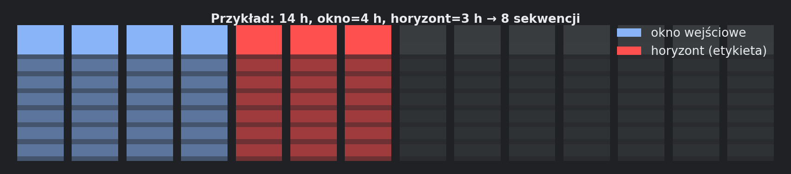
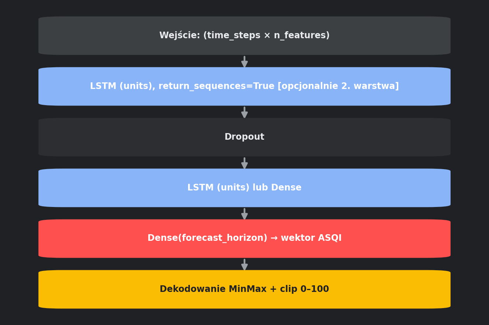

# 6. Sekwencje i trening LSTM

Moduły: `data_fetch.prepare_xy`, `ui_common.train_lstm`, `config.validate_training_params`.

## 6.1. Czym jest sekwencja



Jeden przykład treningowy:

- **X:** tensor `(time_steps, n_features)` — historia cech.
- **y:** wektor `(forecast_horizon,)` — przyszłe wartości `GiosAQI` (etykieta).

Przesunięcie o 1 godzinę → kolejna sekwencja.

### Wzór liczby sekwencji

```
n_seq = n_rows - time_steps - forecast_horizon + 1
```

Horyzont jest odejmowany, bo każda sekwencja potrzebuje **znanej** odpowiedzi w danych (uczenie nadzorowane). Przy inferencji odpowiedzi nie ma — model generuje przyszłość.

Minimum aplikacji: `MIN_TRAIN_SEQUENCES = 48` (`config.py`).

## 6.2. Budowa X i y

```python
# data_fetch.prepare_xy
for i in range(len(feature_array) - time_steps - forecast_horizon + 1):
    X.append(feature_array[i:(i + time_steps), :])
    y.append(target_array[(i + time_steps):(i + time_steps + forecast_horizon)])
```

- `X`: `(n_seq, time_steps, n_features)`
- `y`: `(n_seq, forecast_horizon)`

## 6.3. Podział chronologiczny

| Zbiór | Ułamek sekwencji | Uwagi |
|---|---|---|
| Train | pierwsze 80% | fit modelu |
| Val | następne 10% | early stopping |
| Test | ostatnie 10% | metryki końcowe |

**Bez shuffle** — zachowana kolejność czasowa.

## 6.4. Architektura modelu



`_build_lstm_model()` — Keras `Sequential`:

### 1 warstwa LSTM (`lstm_layers=1`)

```
LSTM(units, input_shape=(time_steps, n_features))
Dropout(dropout)
Dense(forecast_horizon)
```

### 2 warstwy LSTM (domyślnie)

```
LSTM(units, return_sequences=True, ...)
Dropout
LSTM(units, return_sequences=False)
Dropout
Dense(forecast_horizon)
```

Wyjście: **jednowymiarowa trajektoria ASQI** na cały horyzont naraz (nie seq2seq wielu cech jak w starej dokumentacji PDF).

## 6.5. Funkcja straty

| Opcja | Opis |
|---|---|
| `mse` | Standardowa MSE |
| `HorizonWeightedMSE` | Wagi malejące 1.0 → 0.35 wzdłuż horyzontu — bliższe godziny ważniejsze |

Checkbox w adminie: „Loss ważony”. Domyślnie: `DEFAULT_HORIZON_WEIGHTED_LOSS = True`.

## 6.6. Trening — parametry stałe

| Parametr | Wartość |
|---|---|
| optimizer | `adam` |
| batch_size | 16 |
| EarlyStopping | patience=12, restore_best_weights=True |
| Callback UI | `StreamlitKerasCallback` — pasek postępu, loss/val/czas |

## 6.7. Pomiar czasu faktycznego

Po `model.fit()`:
- `training_fit_sec` — czas samego fit
- `training_predict_sec` — predict na teście
- `training_duration_sec` = suma (używane do kalibracji szacunku — rozdz. 7)

## 6.8. Zapis po treningu

1. `model.save(models/<name>.keras)`
2. `np.save(models/<name>_meta.npy, meta_dict)`

Meta zawiera m.in.: `feature_columns`, skalery, `metrics`, `baseline_metrics`, `train_history`, `eval_y_true/pred`, `n_train_sequences`.

Nazwa: `model_registry.build_model_name()` → np. `aq_zabrze_o504_h168_e37_n64_20260604`.

## 6.9. Inferencja (`lstm_forecast`)

1. Ostatnie `time_steps` wierszy `df_proc[feature_columns]`.
2. Skalowanie min/max z meta.
3. `model.predict` → wektor długości `horizon`.
4. Odszkalowanie + **clip 0–100**.
5. Indeks: godziny `last_timestamp + 1h … + horizon`.

Wynik: `pd.Series` nazwana `AirSenseQualityIndex` (ASQI).

## 6.10. Walidacja przed treningiem

`config.validate_training_params()`:
- `n_seq < 48` → blokada + komunikat w UI
- `n_seq < 5` → twardy błąd (drugi próg w kodzie)

Slidery okna/horyzontu ograniczone przez `effective_window_bounds` i `effective_forecast_bounds`.
