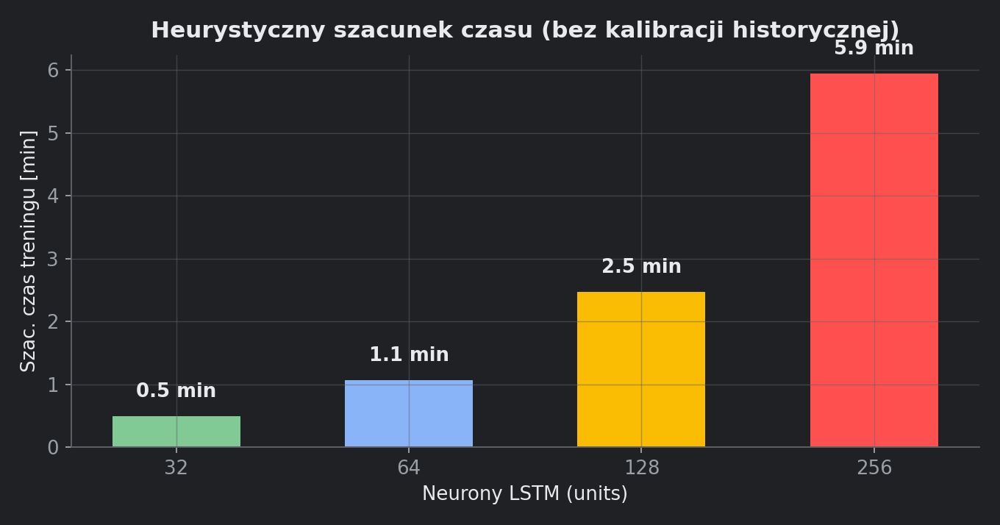

# 7. Szacowanie czasu treningu

Moduł: `training_timing.py`. Wyświetlane w adminie pod sliderami: **„Szac. czas treningu: 3–5 min”**.



## 7.1. Po co to jest

Użytkownik widzi przybliżony czas **przed** kliknięciem „Trenuj”. Po treningu widzi czas **faktyczny** w callbacku epok i w podsumowaniu (`format_duration`).

## 7.2. Wejścia funkcji

`estimate_training_seconds(n_rows, time_steps, forecast_horizon, epochs_max, lstm_units, n_features)`

| Argument | Źródło w UI |
|---|---|
| `n_rows` | `len(df_proc)` — godziny w bazie |
| `time_steps` | slider okna LSTM |
| `forecast_horizon` | slider horyzontu |
| `epochs_max` | slider epok |
| `lstm_units` | slider neuronów |
| `n_features` | `len(feature_cols)` |

## 7.3. Wielkości pośrednie

```python
n_seq = max(0, n_rows - time_steps - forecast_horizon + 1)
n_train = max(1, int(n_seq * 0.8))          # ~80% sekwencji na train
effective_epochs = max(5, epochs_max * 0.72)  # oczekiwany early stop ~72% max epok
```

Założenie: EarlyStopping kończy trening wcześniej niż `epochs_max` — średnio przy ~72% limitu, minimum 5 epok.

## 7.4. Tryb A — kalibracja z historii (preferowany)

`_historical_sec_per_epoch()`:

1. Dla każdego modelu w `models/` wczytaj meta.
2. Oblicz `training_duration_sec / epochs_run`.
3. Weź **medianę** tych wartości → `hist_spe`.

Jeśli jest choć jeden wytrenowany model:

```python
scale = (lstm_units/64)^1.35
      × (time_steps/48)^0.85
      × (n_features/8)^0.4
      × (n_train/400)^0.55

sec = hist_spe × effective_epochs × scale + 4.0
return max(8.0, sec), calibrated=True
```

**Interpretacja skal:**
- Więcej neuronów → wyraźnie dłużej (wykładnik 1.35).
- Dłuższe okno → dłużej (0.85).
- Więcej cech → nieco dłużej (0.4).
- Więcej sekwencji treningowych → dłużej (0.55).

Kalibracja `hist_spe` „kotwiczy” szacunek w **realnym czasie Twojej maszyny**.

## 7.5. Tryb B — heurystyka (brak historii)

Gdy nie ma żadnego modelu z metadanymi:

```python
per_epoch = 0.035
    × (n_train/100)
    × (lstm_units/64)^1.3
    × (time_steps/48)^0.9
    × (n_features/8)^0.35

sec = per_epoch × effective_epochs + 6.0
return max(10.0, sec), calibrated=False
```

Stała `0.035` to empiryczna baza sekund/epokę przy „referencyjnych” parametrach (64 units, 48h okno, 100 seq, 8 cech).

## 7.6. Przedział pokazywany użytkownikowi

`estimate_training_range_label()` — **nie pokazuje dokładnych sekund**, tylko szeroki zakres minut:

| Kalibracja | Mnożniki | Przykład |
|---|---|---|
| Tak (`calibrated=True`) | 0.8× – 1.35× | węższy przedział |
| Nie | 0.45× – 2.2× | szeroki przedział (większa niepewność) |

`_minutes_range_label(lo, hi)` formatuje:
- `<1 min`, `<1–5 min`, `3–5 min`, `12–18 min` itd.

## 7.7. Czas po treningu

`format_duration(seconds)`:
- &lt; 60 s → `"45 s"`
- &lt; 3600 s → `"12.3 min"`
- inaczej → `"1.25 h"`

Używane w:
- `StreamlitKerasCallback.on_epoch_end` — live podczas treningu
- `training_epoch_summary(meta)` — po zapisie modelu

## 7.8. Co wpływa na rozjazd szacunku vs rzeczywistość

| Czynnik | Efekt |
|---|---|
| Early stop wcześniej niż 72% epok | faktyczny czas krótszy |
| Early stop późno (brak poprawy val) | bliżej `epochs_max` |
| Pierwszy model na maszynie | tylko heurystyka — duży rozstrzał |
| Kolejne modele | kalibracja z mediany — lepsze |
| CPU vs GPU | `hist_spe` automatycznie to uwzględnia po 1. treningu |
| Więcej cech (dodatkowe sensory GIOŚ) | scale rośnie |

## 7.9. Przykład liczbowy

Założenia: `n_rows=732`, `time_steps=312`, `horizon=168`, `epochs_max=60`, `units=64`, `n_features=12`.

```
n_seq = 732 - 312 - 168 + 1 = 253
n_train = int(253 × 0.8) = 202
effective_epochs = max(5, 60 × 0.72) = 43.2
```

Komunikat w UI: **„Sekwencje: 253 (min. 48 przy 732 h w bazie)”** — to liczba sekwencji, nie czas.

Szacunek czasu zależy od tego, czy masz już modele w `models/` (kalibracja) czy nie.

## 7.10. Gdzie w kodzie wywołane

`views/admin_router.py`, zakładka Trening:

```python
est_range = training_timing.estimate_training_range_label(
    len(df_proc), time_steps, forecast_horizon, epochs, lstm_units, len(feat_cols),
)
st.caption(f"Szac. czas treningu: **{est_range}**")
```
