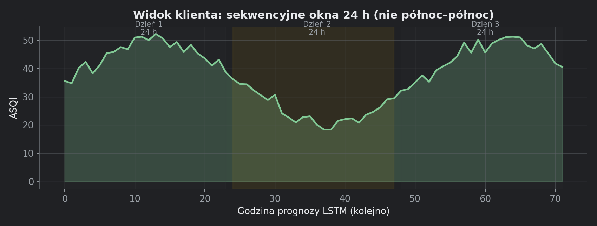

# 10. Widok klienta (`/`)

Moduł: `views/client_page.py`.

## 10.1. Wejście i dane

`render(stations)`:

1. `stations_settings.client_station_choices()` — włączone stacje.
2. `ui.load_processed_data()` — processed + aktualizacja JSON.
3. `_load_lstm_forecast()` — aktywny model + `lstm_forecast`.
4. `ui.load_forecast()` — bundle Open-Meteo (pogoda + AQ).

Brak modelu / danych → `st.error` z komunikatem.

## 10.2. Nagłówek strony

`ui.page_header("Prognoza jakości powietrza — widok klienta")` + wybór stacji + link do admina.

## 10.3. Hero (główny blok)

| Element | Źródło |
|---|---|
| Duża wartość + klasa | `day["headline"]` — pierwsza godzina okna ASQI, `_asqi_style()` |
| Kolor liczby | `class_color(european_class(val))` |
| Meta: GIOŚ AQI teraz | `df_proc[GiosAQI].iloc[-1]` |
| Wilgotność / wiatr | ostatni wiersz `processed` (pomiar, nie prognoza zakładek) |
| Dominujący pollutant | `compute_subindices` na ostatnim wierszu → `idxmax` |
| Prawy blok | dzień tygodnia, data, zakres godzin okna, max/min ASQI w oknie |

## 10.4. Okna czasowe dni — logika

`_forecast_windows(fc_raw)`:

- Bierze **przyszłe** godziny prognozy LSTM (`> now`).
- Dzieli na **kolejne segmenty po 24 h** od pierwszej godziny prognozy.
- **Nie** używa północy kalendarzowej — ciągłość między dniami N i N+1.

Każde okno zawiera: `start`, `end`, `wd`, `date_label`, `hours`, `max`, `min`, `headline`.

## 10.5. Zakładki wykresów

| Zakładka | Dane | Źródło |
|---|---|---|
| **ASQI** | Seria godzinowa w oknie dnia | LSTM (`asqi_hours`) |
| **Temperatura** | `wx_win["Temperatura"]` | Open-Meteo prognoza |
| **Wilgotność** | `wx_win["Wilgotnosc"]` | Open-Meteo prognoza |
| **Wiatr** | `wx_win["Wiatr"]` | Open-Meteo prognoza |

`wx_win = _slice_window(df_future, day["start"], day["end"])` — ten sam zakres co ASQI.

Wykres: `_area_chart()` — Plotly area, wartości na markerach, ciemne tło `#202124`.

## 10.6. Picker dni (dół strony)

`_render_day_picker()`:

- Kafelki HTML: dzień, data, kropka AQI (kolor max), max/min.
- Aktywny dzień: tło `#3c4043`, pasek akcentu u góry.
- Klik: niewidoczny `st.button` (overlay CSS) — kompatybilność ze starszym Streamlit (bez `label_visibility`).
- Stan: `st.session_state[f"client_day_{sid}"]`.

## 10.7. Clip ASQI

`_clip_asqi()` — `np.clip(0, 100)` na serii LSTM (model czasem lekko wykracza po odszkalowaniu).

## 10.8. Styl wizualny

`_inject_client_css()` — paleta Google Weather dark:
- tło `#202124`, tekst `#e8eaed`, akcent zakładek `#fbbc04`.
- Material Icons przez `ui_icons.py`.

## 10.9. Różnica vs admin „Podgląd”

| | Klient | Admin podgląd |
|---|---|---|
| ASQI | tylko LSTM aktywny | LSTM + wybór modelu |
| GIOŚ | meta „teraz” | wykres historyczny ±7 dni |
| Open-Meteo | tylko pogoda w zakładkach | indeks OM + stężenia na wykresie porównawczym |
